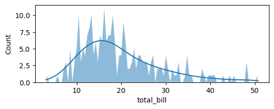
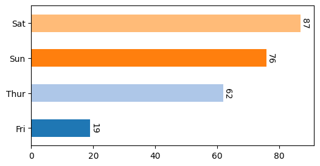
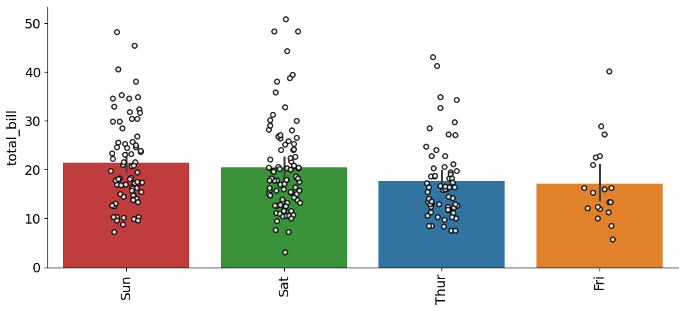
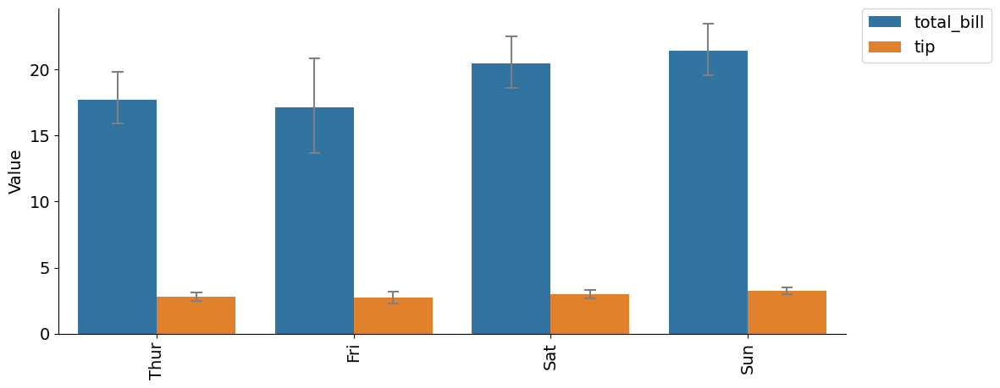
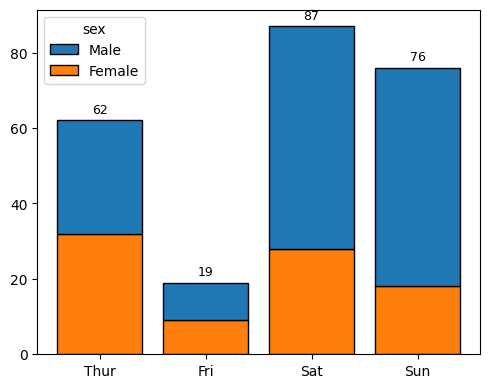
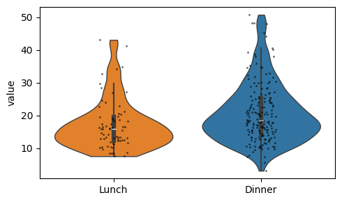
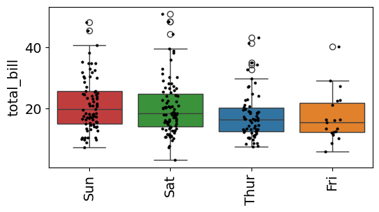
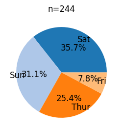
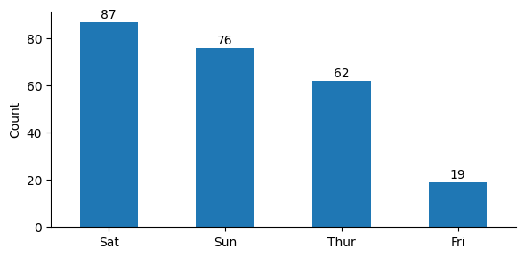
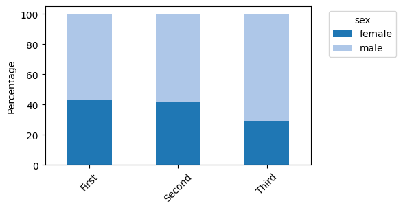

# bar


<!-- WARNING: THIS FILE WAS AUTOGENERATED! DO NOT EDIT! -->

``` python
df = sns.load_dataset('tips').dropna()
df.shape
```

    (244, 7)

``` python
df.head()
```

<div>
<style scoped>
    .dataframe tbody tr th:only-of-type {
        vertical-align: middle;
    }
&#10;    .dataframe tbody tr th {
        vertical-align: top;
    }
&#10;    .dataframe thead th {
        text-align: right;
    }
</style>

<table class="dataframe" data-quarto-postprocess="true" data-border="1">
<thead>
<tr style="text-align: right;">
<th data-quarto-table-cell-role="th"></th>
<th data-quarto-table-cell-role="th">total_bill</th>
<th data-quarto-table-cell-role="th">tip</th>
<th data-quarto-table-cell-role="th">sex</th>
<th data-quarto-table-cell-role="th">smoker</th>
<th data-quarto-table-cell-role="th">day</th>
<th data-quarto-table-cell-role="th">time</th>
<th data-quarto-table-cell-role="th">size</th>
</tr>
</thead>
<tbody>
<tr>
<td data-quarto-table-cell-role="th">0</td>
<td>16.99</td>
<td>1.01</td>
<td>Female</td>
<td>No</td>
<td>Sun</td>
<td>Dinner</td>
<td>2</td>
</tr>
<tr>
<td data-quarto-table-cell-role="th">1</td>
<td>10.34</td>
<td>1.66</td>
<td>Male</td>
<td>No</td>
<td>Sun</td>
<td>Dinner</td>
<td>3</td>
</tr>
<tr>
<td data-quarto-table-cell-role="th">2</td>
<td>21.01</td>
<td>3.50</td>
<td>Male</td>
<td>No</td>
<td>Sun</td>
<td>Dinner</td>
<td>3</td>
</tr>
<tr>
<td data-quarto-table-cell-role="th">3</td>
<td>23.68</td>
<td>3.31</td>
<td>Male</td>
<td>No</td>
<td>Sun</td>
<td>Dinner</td>
<td>2</td>
</tr>
<tr>
<td data-quarto-table-cell-role="th">4</td>
<td>24.59</td>
<td>3.61</td>
<td>Female</td>
<td>No</td>
<td>Sun</td>
<td>Dinner</td>
<td>4</td>
</tr>
</tbody>
</table>

</div>

## Distribution Plots

------------------------------------------------------------------------

### plot_hist

``` python

def plot_hist(
    df:DataFrame, # dataframe containing the values to plot
    x:str, # numeric column name
    figsize:tuple=(6, 2), # figure size in inches
    data:NoneType=None, y:NoneType=None, hue:NoneType=None, weights:NoneType=None, # Vector variables
    stat:str='count', bins:str='auto', binwidth:NoneType=None,
    binrange:NoneType=None, # Histogram computation parameters
    discrete:NoneType=None, cumulative:bool=False, common_bins:bool=True, common_norm:bool=True,
    multiple:str='layer', element:str='bars', fill:bool=True, shrink:int=1, # Histogram appearance parameters
    kde:bool=False, kde_kws:NoneType=None,
    line_kws:NoneType=None, # Histogram smoothing with a kernel density estimate
    thresh:int=0, pthresh:NoneType=None, pmax:NoneType=None, cbar:bool=False, cbar_ax:NoneType=None,
    cbar_kws:NoneType=None, # Bivariate histogram parameters
    palette:NoneType=None, hue_order:NoneType=None, hue_norm:NoneType=None,
    color:NoneType=None, # Hue mapping parameters
    log_scale:NoneType=None, legend:bool=True, ax:NoneType=None, # Axes information
):

```

*Plot a histogram with a KDE overlay and polygon bins.*

``` python
plot_hist(df, 'total_bill')
```



## Count And Bar Plots

------------------------------------------------------------------------

### plot_count

``` python

def plot_count(
    cnt:Series, # output of df[col].value_counts()
    tick_spacing:float | None=None, # optional major tick interval
    palette:str='tab20', # seaborn palette name
):

```

*Plot horizontal counts from a value-count series.*

``` python
plot_count(df['day'].value_counts())
```



------------------------------------------------------------------------

### plot_bar

``` python

def plot_bar(
    df:DataFrame, # long-form dataframe
    value:str, # numeric column name
    group:str, # grouping column name
    title:str | None=None, # optional plot title
    figsize:tuple=(12, 5), # figure size in inches
    fontsize:int=14, # axis label and tick size
    dots:bool=True, # whether to overlay strip dots
    rotation:float=90, # x tick rotation angle
    ascending:bool=False, # sort group means ascending when True
    ymin:float | None=None, # optional lower y-axis bound
    data:NoneType=None, x:NoneType=None, y:NoneType=None, hue:NoneType=None, order:NoneType=None,
    hue_order:NoneType=None, estimator:str='mean', errorbar:tuple=('ci', 95), n_boot:int=1000, seed:NoneType=None,
    units:NoneType=None, weights:NoneType=None, orient:NoneType=None, color:NoneType=None, palette:NoneType=None,
    saturation:float=0.75, fill:bool=True, hue_norm:NoneType=None, width:float=0.8, dodge:str='auto', gap:int=0,
    log_scale:NoneType=None, native_scale:bool=False, formatter:NoneType=None, legend:str='auto', capsize:int=0,
    err_kws:NoneType=None, ci:Deprecated=<deprecated>, errcolor:Deprecated=<deprecated>,
    errwidth:Deprecated=<deprecated>, ax:NoneType=None
):

```

*Plot a bar chart from an unstacked dataframe.*

``` python
plot_bar(df, value='total_bill', group='day')
```



------------------------------------------------------------------------

### plot_group_bar

``` python

def plot_group_bar(
    df:DataFrame, # wide-form dataframe
    value_cols:list, # numeric columns to melt into grouped bars
    group:str, # grouping column preserved during melt
    figsize:tuple=(12, 5), # figure size in inches
    order:NoneType=None, # optional x order passed to seaborn
    title:str | None=None, # optional plot title
    fontsize:int=14, # axis label and tick size
    rotation:float=90, # x tick rotation angle
    data:NoneType=None, x:NoneType=None, y:NoneType=None, hue:NoneType=None, hue_order:NoneType=None,
    estimator:str='mean', errorbar:tuple=('ci', 95), n_boot:int=1000, seed:NoneType=None, units:NoneType=None,
    weights:NoneType=None, orient:NoneType=None, color:NoneType=None, palette:NoneType=None, saturation:float=0.75,
    fill:bool=True, hue_norm:NoneType=None, width:float=0.8, dodge:str='auto', gap:int=0, log_scale:NoneType=None,
    native_scale:bool=False, formatter:NoneType=None, legend:str='auto', capsize:int=0, err_kws:NoneType=None,
    ci:Deprecated=<deprecated>, errcolor:Deprecated=<deprecated>, errwidth:Deprecated=<deprecated>, ax:NoneType=None
):

```

*Plot grouped bars after melting multiple value columns.*

``` python
plot_group_bar(df, value_cols=['total_bill', 'tip'], group='day')
```



------------------------------------------------------------------------

### plot_stacked

``` python

def plot_stacked(
    df:DataFrame, # dataframe containing the stacked categories
    group:str, # x-axis categorical column
    hue:str, # stacked hue column
    figsize:tuple=(5, 4), # figure size in inches
    xlabel:str | None=None, # x-axis label override
    ylabel:str | None=None, # y-axis label override
    add_value:bool=True, # whether to annotate total counts
    kwargs:VAR_KEYWORD
):

```

*Plot stacked counts for a categorical column.*

``` python
plot_stacked(df, group='day', hue='sex')
```



## Distribution Comparisons

------------------------------------------------------------------------

### plot_violin

``` python

def plot_violin(
    df:DataFrame, # long-form dataframe with value and group columns
    value:str='value', # numeric column name
    group:str='variable', # grouping column name
    ylabel:str | None=None, # optional y-axis label override
    dots:bool=True, # whether to overlay strip dots
    figsize:tuple=(5, 3), # figure size in inches
    kwargs:VAR_KEYWORD
):

```

*Plot violin plots with optional strip dots.*

``` python
df2 = df[['time', 'total_bill']].rename(columns={'time': 'variable', 'total_bill': 'value'})
plot_violin(df2)
```



------------------------------------------------------------------------

### plot_box

``` python

def plot_box(
    df:DataFrame, # long-form dataframe
    value:str, # numeric column name
    group:str, # grouping column name
    title:str | None=None, # optional plot title
    figsize:tuple=(6, 3), # figure size in inches
    fontsize:int=14, # axis label and tick size
    dots:bool=True, # whether to overlay strip dots
    rotation:float=90, # x tick rotation angle
    data:NoneType=None, x:NoneType=None, y:NoneType=None, hue:NoneType=None, order:NoneType=None,
    hue_order:NoneType=None, orient:NoneType=None, color:NoneType=None, palette:NoneType=None, saturation:float=0.75,
    fill:bool=True, dodge:str='auto', width:float=0.8, gap:int=0, whis:float=1.5, linecolor:str='auto',
    linewidth:NoneType=None, fliersize:NoneType=None, hue_norm:NoneType=None, native_scale:bool=False,
    log_scale:NoneType=None, formatter:NoneType=None, legend:str='auto', ax:NoneType=None
):

```

*Plot a box plot ordered by the group median.*

``` python
plot_box(df, value='total_bill', group='day')
```



## Pie And Count Labels

------------------------------------------------------------------------

### plot_pie

``` python

def plot_pie(
    value_counts:Series, # categorical counts
    hue_order:list[str] | None=None, # explicit slice order
    labeldistance:float=0.8, # distance of labels from the center
    fontsize:int=12, # label font size
    font_color:str='black', # label font color
    palette:str='tab20', # seaborn palette name
    figsize:tuple=(4, 3), # figure size in inches
):

```

*Plot a pie chart from a value-count series.*

``` python
plot_pie(df['day'].value_counts())
```



------------------------------------------------------------------------

### plot_cnt

``` python

def plot_cnt(
    cnt:Series, # output of df[col].value_counts()
    xlabel:str | None=None, # x-axis label override
    ylabel:str='Count', # y-axis label override
    figsize:tuple=(6, 3), # figure size in inches
):

```

*Plot vertical counts with labels above the bars.*

``` python
plot_cnt(df['day'].value_counts())
```



## Composition

------------------------------------------------------------------------

### calculate_pct

``` python

def calculate_pct(
    df:DataFrame, # source dataframe
    bin_col:str, # binned x-axis column
    hue_col:str, # stacked hue column
)->DataFrame:

```

*Calculate within-bin percentages for a stacked composition chart.*

``` python
df2 = sns.load_dataset('titanic').dropna(subset=['class', 'sex']).reset_index(drop=True)
calculate_pct(df2, 'class', 'sex')
```

<div>
<style scoped>
    .dataframe tbody tr th:only-of-type {
        vertical-align: middle;
    }
&#10;    .dataframe tbody tr th {
        vertical-align: top;
    }
&#10;    .dataframe thead th {
        text-align: right;
    }
</style>

<table class="dataframe" data-quarto-postprocess="true" data-border="1">
<thead>
<tr style="text-align: right;">
<th data-quarto-table-cell-role="th">sex</th>
<th data-quarto-table-cell-role="th">female</th>
<th data-quarto-table-cell-role="th">male</th>
</tr>
<tr>
<th data-quarto-table-cell-role="th">class</th>
<th data-quarto-table-cell-role="th"></th>
<th data-quarto-table-cell-role="th"></th>
</tr>
</thead>
<tbody>
<tr>
<td data-quarto-table-cell-role="th">First</td>
<td>43.518519</td>
<td>56.481481</td>
</tr>
<tr>
<td data-quarto-table-cell-role="th">Second</td>
<td>41.304348</td>
<td>58.695652</td>
</tr>
<tr>
<td data-quarto-table-cell-role="th">Third</td>
<td>29.327902</td>
<td>70.672098</td>
</tr>
</tbody>
</table>

</div>

------------------------------------------------------------------------

### plot_composition

``` python

def plot_composition(
    df:DataFrame, # source dataframe
    bin_col:str, # binned x-axis column
    hue_col:str, # stacked hue column
    palette:dict | list | str='tab20', # colors passed to get_plt_color
    legend_title:str | None=None, # legend title override
    rotation:float=45, # x tick rotation angle
    xlabel:str | None=None, # x-axis label override
    ylabel:str='Percentage', # y-axis label override
    figsize:tuple=(5, 3), # figure size in inches
):

```

*Plot stacked percentages for a bin-by-category composition.*

``` python
plot_composition(df2, 'class', 'sex')
```


