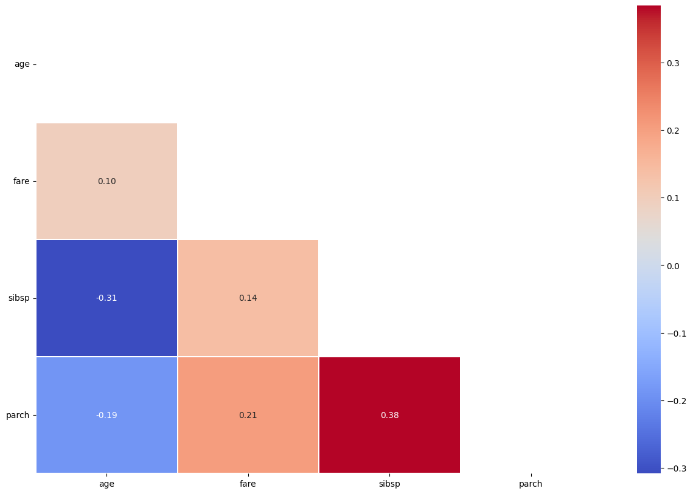
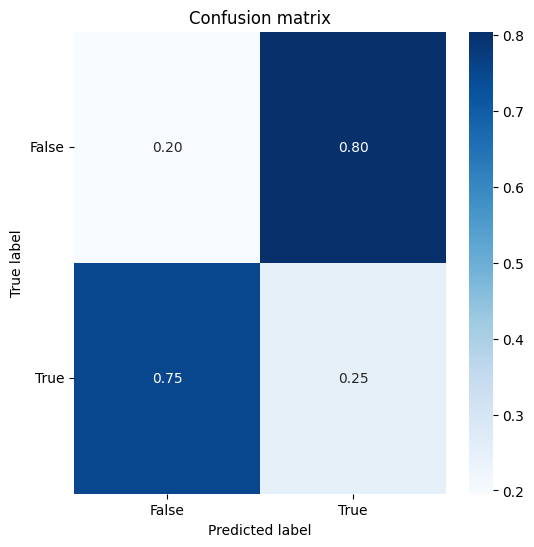

# heatmap


<!-- WARNING: THIS FILE WAS AUTOGENERATED! DO NOT EDIT! -->

``` python
df = sns.load_dataset('titanic').dropna(subset=['age', 'fare', 'class', 'sex', 'survived']).reset_index(drop=True)
df2 = df[['age', 'fare', 'sibsp', 'parch']].head(8).copy()
df2.index = [f'row_{i}' for i in range(len(df2))]
print(df.shape)
print(df2.shape)
```

    (714, 15)
    (8, 4)

``` python
df.head()
```

<div>
<style scoped>
    .dataframe tbody tr th:only-of-type {
        vertical-align: middle;
    }
&#10;    .dataframe tbody tr th {
        vertical-align: top;
    }
&#10;    .dataframe thead th {
        text-align: right;
    }
</style>

<table class="dataframe" data-quarto-postprocess="true" data-border="1">
<thead>
<tr style="text-align: right;">
<th data-quarto-table-cell-role="th"></th>
<th data-quarto-table-cell-role="th">survived</th>
<th data-quarto-table-cell-role="th">pclass</th>
<th data-quarto-table-cell-role="th">sex</th>
<th data-quarto-table-cell-role="th">age</th>
<th data-quarto-table-cell-role="th">sibsp</th>
<th data-quarto-table-cell-role="th">parch</th>
<th data-quarto-table-cell-role="th">fare</th>
<th data-quarto-table-cell-role="th">embarked</th>
<th data-quarto-table-cell-role="th">class</th>
<th data-quarto-table-cell-role="th">who</th>
<th data-quarto-table-cell-role="th">adult_male</th>
<th data-quarto-table-cell-role="th">deck</th>
<th data-quarto-table-cell-role="th">embark_town</th>
<th data-quarto-table-cell-role="th">alive</th>
<th data-quarto-table-cell-role="th">alone</th>
</tr>
</thead>
<tbody>
<tr>
<td data-quarto-table-cell-role="th">0</td>
<td>0</td>
<td>3</td>
<td>male</td>
<td>22.0</td>
<td>1</td>
<td>0</td>
<td>7.2500</td>
<td>S</td>
<td>Third</td>
<td>man</td>
<td>True</td>
<td>NaN</td>
<td>Southampton</td>
<td>no</td>
<td>False</td>
</tr>
<tr>
<td data-quarto-table-cell-role="th">1</td>
<td>1</td>
<td>1</td>
<td>female</td>
<td>38.0</td>
<td>1</td>
<td>0</td>
<td>71.2833</td>
<td>C</td>
<td>First</td>
<td>woman</td>
<td>False</td>
<td>C</td>
<td>Cherbourg</td>
<td>yes</td>
<td>False</td>
</tr>
<tr>
<td data-quarto-table-cell-role="th">2</td>
<td>1</td>
<td>3</td>
<td>female</td>
<td>26.0</td>
<td>0</td>
<td>0</td>
<td>7.9250</td>
<td>S</td>
<td>Third</td>
<td>woman</td>
<td>False</td>
<td>NaN</td>
<td>Southampton</td>
<td>yes</td>
<td>True</td>
</tr>
<tr>
<td data-quarto-table-cell-role="th">3</td>
<td>1</td>
<td>1</td>
<td>female</td>
<td>35.0</td>
<td>1</td>
<td>0</td>
<td>53.1000</td>
<td>S</td>
<td>First</td>
<td>woman</td>
<td>False</td>
<td>C</td>
<td>Southampton</td>
<td>yes</td>
<td>False</td>
</tr>
<tr>
<td data-quarto-table-cell-role="th">4</td>
<td>0</td>
<td>3</td>
<td>male</td>
<td>35.0</td>
<td>0</td>
<td>0</td>
<td>8.0500</td>
<td>S</td>
<td>Third</td>
<td>man</td>
<td>True</td>
<td>NaN</td>
<td>Southampton</td>
<td>no</td>
<td>True</td>
</tr>
</tbody>
</table>

</div>

## Matrix Helpers

------------------------------------------------------------------------

### get_similarity

``` python

def get_similarity(
    df:DataFrame, # numeric feature matrix indexed by sample name
    metric:str='euclidean', # pairwise_distances metric name
)->tuple:

```

*Calculate both distance and similarity matrices for a dataframe.*

``` python
get_similarity(df2)[0]
```

<div>
<style scoped>
    .dataframe tbody tr th:only-of-type {
        vertical-align: middle;
    }
&#10;    .dataframe tbody tr th {
        vertical-align: top;
    }
&#10;    .dataframe thead th {
        text-align: right;
    }
</style>

<table class="dataframe" data-quarto-postprocess="true" data-border="1">
<thead>
<tr style="text-align: right;">
<th data-quarto-table-cell-role="th"></th>
<th data-quarto-table-cell-role="th">row_0</th>
<th data-quarto-table-cell-role="th">row_1</th>
<th data-quarto-table-cell-role="th">row_2</th>
<th data-quarto-table-cell-role="th">row_3</th>
<th data-quarto-table-cell-role="th">row_4</th>
<th data-quarto-table-cell-role="th">row_5</th>
<th data-quarto-table-cell-role="th">row_6</th>
<th data-quarto-table-cell-role="th">row_7</th>
</tr>
</thead>
<tbody>
<tr>
<td data-quarto-table-cell-role="th">row_0</td>
<td>0.000000</td>
<td>66.001996</td>
<td>4.177993</td>
<td>47.657345</td>
<td>13.062925</td>
<td>54.911521</td>
<td>24.415786</td>
<td>6.714166</td>
</tr>
<tr>
<td data-quarto-table-cell-role="th">row_1</td>
<td>66.001996</td>
<td>0.000000</td>
<td>64.492435</td>
<td>18.429118</td>
<td>63.312323</td>
<td>25.182682</td>
<td>61.821302</td>
<td>61.188418</td>
</tr>
<tr>
<td data-quarto-table-cell-role="th">row_2</td>
<td>4.177993</td>
<td>64.492435</td>
<td>0.000000</td>
<td>46.073643</td>
<td>9.000868</td>
<td>52.100901</td>
<td>27.548548</td>
<td>3.910651</td>
</tr>
<tr>
<td data-quarto-table-cell-role="th">row_3</td>
<td>47.657345</td>
<td>18.429118</td>
<td>46.073643</td>
<td>0.000000</td>
<td>45.061097</td>
<td>19.066500</td>
<td>46.039121</td>
<td>42.780883</td>
</tr>
<tr>
<td data-quarto-table-cell-role="th">row_4</td>
<td>13.062925</td>
<td>63.312323</td>
<td>9.000868</td>
<td>45.061097</td>
<td>0.000000</td>
<td>47.754949</td>
<td>35.618122</td>
<td>8.803791</td>
</tr>
<tr>
<td data-quarto-table-cell-role="th">row_5</td>
<td>54.911521</td>
<td>25.182682</td>
<td>52.100901</td>
<td>19.066500</td>
<td>47.754949</td>
<td>0.000000</td>
<td>60.513388</td>
<td>48.906725</td>
</tr>
<tr>
<td data-quarto-table-cell-role="th">row_6</td>
<td>24.415786</td>
<td>61.821302</td>
<td>27.548548</td>
<td>46.039121</td>
<td>35.618122</td>
<td>60.513388</td>
<td>0.000000</td>
<td>27.089433</td>
</tr>
<tr>
<td data-quarto-table-cell-role="th">row_7</td>
<td>6.714166</td>
<td>61.188418</td>
<td>3.910651</td>
<td>42.780883</td>
<td>8.803791</td>
<td>48.906725</td>
<td>27.089433</td>
<td>0.000000</td>
</tr>
</tbody>
</table>

</div>

------------------------------------------------------------------------

### plot_corr

``` python

def plot_corr(
    df_corr:DataFrame, # correlation, distance, or similarity matrix
    mask_method:str | None='upper', # upper, lower, or None
    inverse_color:bool=False, # reverse the colormap when True
    figsize:tuple=(15, 10), # figure size in inches
    annot:bool=True, # whether to annotate the matrix values
    linewidths:float=0.1, # cell border width
    kwargs:VAR_KEYWORD
):

```

*Plot a square matrix with an optional triangular mask.*

``` python
plot_corr(df[['age', 'fare', 'sibsp', 'parch']].corr(numeric_only=True))
```



## Classification And Composition

------------------------------------------------------------------------

### plot_confusion_matrix

``` python

def plot_confusion_matrix(
    target, # true labels
    pred, # predicted labels
    class_names:list[str] | None=None, # labels shown on the axes
    normalize:bool=False, # normalize rows when True
    title:str='Confusion matrix', # plot title
    cmap:LinearSegmentedColormap=<matplotlib.colors.LinearSegmentedColormap object at 0x7f9d7e4ea5d0>, # matplotlib colormap
    figsize:tuple=(6, 6), # figure size in inches
    kwargs:VAR_KEYWORD
):

```

*Plot a confusion matrix from target and prediction arrays.*

``` python
plot_confusion_matrix(df['survived'], df['adult_male'], class_names=['False', 'True'], normalize=True)
```

    Normalized confusion matrix


