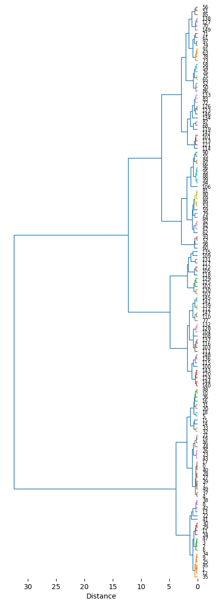
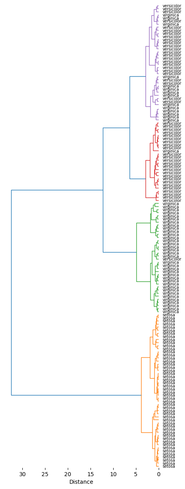

# hierarchical


<!-- WARNING: THIS FILE WAS AUTOGENERATED! DO NOT EDIT! -->

## Setup

## Example dataset

``` python
df0=sns.load_dataset("iris")
df0.head()
```

<div>
<style scoped>
    .dataframe tbody tr th:only-of-type {
        vertical-align: middle;
    }
&#10;    .dataframe tbody tr th {
        vertical-align: top;
    }
&#10;    .dataframe thead th {
        text-align: right;
    }
</style>

<table class="dataframe" data-quarto-postprocess="true" data-border="1">
<thead>
<tr style="text-align: right;">
<th data-quarto-table-cell-role="th"></th>
<th data-quarto-table-cell-role="th">sepal_length</th>
<th data-quarto-table-cell-role="th">sepal_width</th>
<th data-quarto-table-cell-role="th">petal_length</th>
<th data-quarto-table-cell-role="th">petal_width</th>
<th data-quarto-table-cell-role="th">species</th>
</tr>
</thead>
<tbody>
<tr>
<td data-quarto-table-cell-role="th">0</td>
<td>5.1</td>
<td>3.5</td>
<td>1.4</td>
<td>0.2</td>
<td>setosa</td>
</tr>
<tr>
<td data-quarto-table-cell-role="th">1</td>
<td>4.9</td>
<td>3.0</td>
<td>1.4</td>
<td>0.2</td>
<td>setosa</td>
</tr>
<tr>
<td data-quarto-table-cell-role="th">2</td>
<td>4.7</td>
<td>3.2</td>
<td>1.3</td>
<td>0.2</td>
<td>setosa</td>
</tr>
<tr>
<td data-quarto-table-cell-role="th">3</td>
<td>4.6</td>
<td>3.1</td>
<td>1.5</td>
<td>0.2</td>
<td>setosa</td>
</tr>
<tr>
<td data-quarto-table-cell-role="th">4</td>
<td>5.0</td>
<td>3.6</td>
<td>1.4</td>
<td>0.2</td>
<td>setosa</td>
</tr>
</tbody>
</table>

</div>

``` python
df0.species.value_counts()
```

    species
    setosa        50
    versicolor    50
    virginica     50
    Name: count, dtype: int64

``` python
df = df0.drop(columns="species")
```

## Distance

Although pdist from scipy can calculate 1D distance of self matrix (row
by row) with customized function, the function is limited without key on
the vector. In this module, we’d like to make functions that can
consider key in the vector when calculating distance between two
vectors, so the input should take dataframe for datatable and pd.Series
for vectors.

``` python
def my_distance(u, v):
    "Manhattan distance"
    return np.sum(np.abs(u - v))
```

``` python
A = np.array([[0, 0],
              [1, 1],
              [2, 2]])
pdist(A,metric=my_distance)
```

    array([2., 4., 2.])

``` python
pdist(df,metric=my_distance)
```

    array([0.7, 0.8, 1. , ..., 1.2, 0.9, 1.5], shape=(11175,))

``` python
pdist(df,metric=euclidean)
```

    array([0.53851648, 0.50990195, 0.64807407, ..., 0.6164414 , 0.64031242,
           0.76811457], shape=(11175,))

------------------------------------------------------------------------

### get_1d_distance

``` python

def get_1d_distance(
    df, func_flat
):

```

*Compute 1D distance (like pdist from scipy) but for df with column
names*

``` python
# return 1d distance
get_1d_distance(pd.DataFrame(A),func_flat=my_distance)
```

    100%|██████████| 3/3 [00:00<00:00, 8823.92it/s]

    array([2, 4, 2])

Parallel computing to accelerate when flattened pssms are too many in a
df:

------------------------------------------------------------------------

### get_1d_distance_parallel

``` python

def get_1d_distance_parallel(
    df, func_flat, max_workers:int=4, chunksize:int=100
):

```

*Parallel compute 1D distance for each row in a dataframe given a
distance function*

``` python
# get_1d_distance_parallel(df, func_flat=my_distance)
```

------------------------------------------------------------------------

### get_Z

``` python

def get_Z(
    pssms, func_flat, method:str='ward', parallel:bool=True
):

```

*Get linkage matrix Z from pssms dataframe*

``` python
Z = get_Z(df,func_flat=euclidean,parallel=False)
```

    100%|██████████| 150/150 [00:00<00:00, 539.11it/s]

    CPU times: user 274 ms, sys: 5.29 ms, total: 279 ms
    Wall time: 280 ms

``` python
Z[:5]
```

    array([[1.01e+02, 1.42e+02, 0.00e+00, 2.00e+00],
           [7.00e+00, 3.90e+01, 1.00e-01, 2.00e+00],
           [0.00e+00, 1.70e+01, 1.00e-01, 2.00e+00],
           [9.00e+00, 3.40e+01, 1.00e-01, 2.00e+00],
           [1.28e+02, 1.32e+02, 1.00e-01, 2.00e+00]])

------------------------------------------------------------------------

### plot_dendrogram

``` python

def plot_dendrogram(
    Z, thr:float=0.07, dense:int=4, # the higher the more dense for each row
    line_width:int=1, title:NoneType=None, scale:int=1, kwargs:VAR_KEYWORD
):

```

*Call self as a function.*

``` python
plot_dendrogram(Z,dense=10,labels=df.index,thr=0.5)
```



## Pipeline

------------------------------------------------------------------------

### get_hcluster

``` python

def get_hcluster(
    df, thr:float=0.07, plot:bool=True, labels:NoneType=None, func_flat:function=euclidean, method:str='ward',
    kwargs:VAR_KEYWORD
):

```

*Get flat cluster assignments from hierarchical clustering linkage
matrix `Z`.*

``` python
get_hcluster(df,labels=df0['species'].tolist(),thr=5,dense=10)
```

    0      1
    1      1
    2      1
    3      1
    4      1
          ..
    145    2
    146    4
    147    2
    148    2
    149    4
    Length: 150, dtype: int32


