# kplot


<!-- WARNING: THIS FILE WAS AUTOGENERATED! DO NOT EDIT! -->

kplot is a Python plotting toolkit for exploratory data analysis. It
provides reusable helpers for styling figures, scatter and embedding
plots, categorical summaries, heatmaps, hierarchical clustering, and
related ranking workflows.

## Installation

``` bash
pip install python-kplot
```

## Quick start

The examples below follow the notebooks under `nbs/` in order. Each
function example lives in its own cell and starts with a short comment
derived from the function docstring.

### 01 utils

``` python
from kplot.utils import set_sns, save_svg, save_pdf, save_show, get_color_dict, get_plt_color, get_hue_big, add_stats
```

``` python
import seaborn as sns
from matplotlib import pyplot as plt

# Set up the objects used by the examples below.
df = sns.load_dataset('tips')
df.shape
```

    (244, 7)

``` python
# Set seaborn defaults for notebook display and saved figures.
set_sns(dpi=50)
```

``` python
# Save the current matplotlib figure as SVG with editable text.
plt.figure()
plt.plot([0, 1], [0, 1])
# save_svg(Path('nbs') / '_tmp_utils.svg')
```

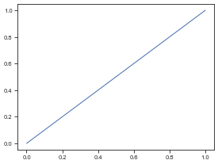

``` python
# Save the current matplotlib figure as PDF with TrueType fonts.
plt.figure()
plt.plot([0, 1], [1, 0])
# save_pdf(Path('nbs') / '_tmp_utils.pdf')
```

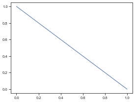

``` python
# Show the current figure or save it, then close open figures.
plt.figure()
plt.plot([0, 1], [0.5, 0.5])
# save_show(path=Path('nbs') / '_tmp_utils_show.png')
```

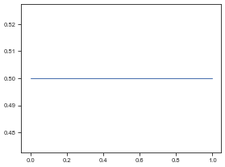

``` python
# Assign colors to labels while tolerating duplicate category names.
get_color_dict(['A', 'B', 'C'], palette='Set2')
```

    {'A': (0.4, 0.7607843137254902, 0.6470588235294118),
     'B': (0.9882352941176471, 0.5529411764705883, 0.3843137254901961),
     'C': (0.5529411764705883, 0.6274509803921569, 0.796078431372549)}

``` python
# Return colors in plotting order for a dict, list, or named palette.
get_plt_color('Set2', ['a', 'b'])
```

<svg  width="110" height="55"><rect x="0" y="0" width="55" height="55" style="fill:#66c2a5;stroke-width:2;stroke:rgb(255,255,255)"/><rect x="55" y="0" width="55" height="55" style="fill:#fc8d62;stroke-width:2;stroke:rgb(255,255,255)"/></svg>

``` python
# Filter a hue column down to categories that meet a count threshold.
# get_hue_big(df, 'day', cnt_thr=40).tolist()
```

``` python
# If `value` is str: compare between groups (x=group, y=value) If `value` is list/tuple: compare among values within each group (x=group, hue='variable')
fig, ax = plt.subplots(figsize=(5, 4))
sns.boxplot(data=df, x='sex', y='total_bill', ax=ax)
add_stats(ax, df, value='total_bill', group='sex')
```

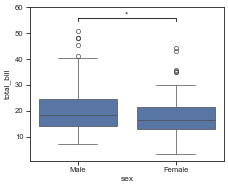

### 02 scatter

``` python
from kplot.scatter import reduce_feature, plot_2d, plot_cluster, plot_rel
```

``` python
import seaborn as sns

# Set up the objects used by the examples below.
df = sns.load_dataset('penguins').dropna().reset_index(drop=True)
df2 = df[['bill_length_mm', 'bill_depth_mm', 'flipper_length_mm', 'body_mass_g']]
print(df.shape)
print(df2.shape)
```

    (333, 7)
    (333, 4)

``` python
# Reduce a feature matrix to a lower-dimensional embedding dataframe.
reduce_feature(df2, method='pca', n=2)
```

<div>
<style scoped>
    .dataframe tbody tr th:only-of-type {
        vertical-align: middle;
    }
&#10;    .dataframe tbody tr th {
        vertical-align: top;
    }
&#10;    .dataframe thead th {
        text-align: right;
    }
</style>

<table class="dataframe" data-quarto-postprocess="true" data-border="1">
<thead>
<tr style="text-align: right;">
<th data-quarto-table-cell-role="th"></th>
<th data-quarto-table-cell-role="th">PCA1</th>
<th data-quarto-table-cell-role="th">PCA2</th>
</tr>
</thead>
<tbody>
<tr>
<td data-quarto-table-cell-role="th">0</td>
<td>-457.325073</td>
<td>-13.351587</td>
</tr>
<tr>
<td data-quarto-table-cell-role="th">1</td>
<td>-407.252205</td>
<td>-9.179113</td>
</tr>
<tr>
<td data-quarto-table-cell-role="th">2</td>
<td>-957.044676</td>
<td>8.160444</td>
</tr>
<tr>
<td data-quarto-table-cell-role="th">3</td>
<td>-757.115802</td>
<td>1.867653</td>
</tr>
<tr>
<td data-quarto-table-cell-role="th">4</td>
<td>-557.177302</td>
<td>-3.389158</td>
</tr>
<tr>
<td data-quarto-table-cell-role="th">...</td>
<td>...</td>
<td>...</td>
</tr>
<tr>
<td data-quarto-table-cell-role="th">328</td>
<td>718.068699</td>
<td>2.338199</td>
</tr>
<tr>
<td data-quarto-table-cell-role="th">329</td>
<td>643.090909</td>
<td>4.280699</td>
</tr>
<tr>
<td data-quarto-table-cell-role="th">330</td>
<td>1543.098355</td>
<td>-2.232010</td>
</tr>
<tr>
<td data-quarto-table-cell-role="th">331</td>
<td>992.994900</td>
<td>-4.605154</td>
</tr>
<tr>
<td data-quarto-table-cell-role="th">332</td>
<td>1193.002584</td>
<td>-5.417312</td>
</tr>
</tbody>
</table>

<p>333 rows × 2 columns</p>
</div>

``` python
# Plot the first two columns of an embedding dataframe.
df2 = reduce_feature(df[['bill_length_mm', 'bill_depth_mm', 'flipper_length_mm', 'body_mass_g']], method='pca', n=2)
df2['species'] = df['species'].values
plot_2d(df2, hue='species', legend=True)
```

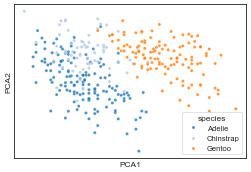

``` python
# Reduce features and immediately plot the first two embedding dimensions.
plot_cluster(df[['bill_length_mm', 'bill_depth_mm', 'flipper_length_mm', 'body_mass_g', 'species']], method='pca', hue='species', legend=True)
```

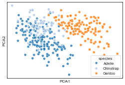

``` python
# Plot a pairwise relationship with an optional correlation annotation.
df2 = df[['bill_length_mm', 'flipper_length_mm', 'species']].head(12).copy()
df2.index = [f'pt{i}' for i in range(len(df2))]
plot_rel(df2, x='bill_length_mm', y='flipper_length_mm', hue='species', index_list=['pt0', 'pt11'])
```

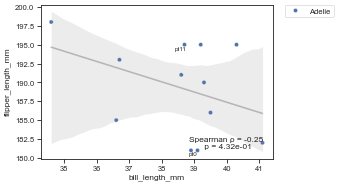

### 03 bar

``` python
from kplot.bar import plot_hist, plot_count, plot_bar, plot_group_bar, plot_stacked, plot_violin, plot_box, plot_pie, plot_cnt, calculate_pct, plot_composition
```

``` python
import seaborn as sns

# Set up the objects used by the examples below.
df = sns.load_dataset('tips').dropna()
df.shape
```

    (244, 7)

``` python
# Plot a histogram with a KDE overlay and polygon bins.
plot_hist(df, 'total_bill')
```

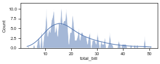

``` python
# Plot horizontal counts from a value-count series.
plot_count(df['day'].value_counts())
```

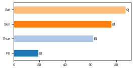

``` python
# Plot a bar chart from an unstacked dataframe.
plot_bar(df, value='total_bill', group='day')
```

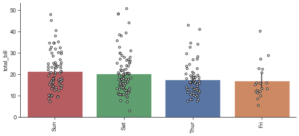

``` python
# Plot grouped bars after melting multiple value columns.
plot_group_bar(df, value_cols=['total_bill', 'tip'], group='day')
```

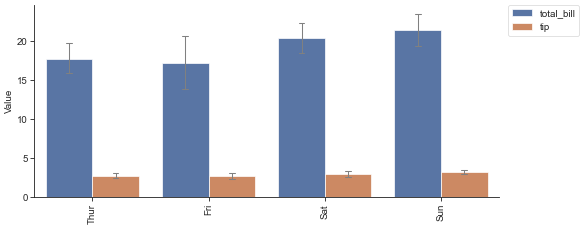

``` python
# Plot stacked counts for a categorical column.
plot_stacked(df, group='day', hue='sex')
```

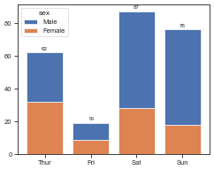

``` python
# Plot violin plots with optional strip dots.
df2 = df[['time', 'total_bill']].rename(columns={'time': 'variable', 'total_bill': 'value'})
plot_violin(df2)
```

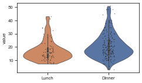

``` python
# Plot a box plot ordered by the group median.
plot_box(df, value='total_bill', group='day')
```

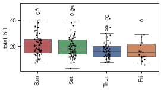

``` python
# Plot a pie chart from a value-count series.
plot_pie(df['day'].value_counts())
```

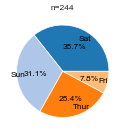

``` python
# Plot vertical counts with labels above the bars.
plot_cnt(df['day'].value_counts())
```

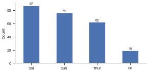

``` python
# Calculate within-bin percentages for a stacked composition chart.
df2 = sns.load_dataset('titanic').dropna(subset=['class', 'sex']).reset_index(drop=True)
calculate_pct(df2, 'class', 'sex')
```

<div>
<style scoped>
    .dataframe tbody tr th:only-of-type {
        vertical-align: middle;
    }
&#10;    .dataframe tbody tr th {
        vertical-align: top;
    }
&#10;    .dataframe thead th {
        text-align: right;
    }
</style>

<table class="dataframe" data-quarto-postprocess="true" data-border="1">
<thead>
<tr style="text-align: right;">
<th data-quarto-table-cell-role="th">sex</th>
<th data-quarto-table-cell-role="th">female</th>
<th data-quarto-table-cell-role="th">male</th>
</tr>
<tr>
<th data-quarto-table-cell-role="th">class</th>
<th data-quarto-table-cell-role="th"></th>
<th data-quarto-table-cell-role="th"></th>
</tr>
</thead>
<tbody>
<tr>
<td data-quarto-table-cell-role="th">First</td>
<td>43.518519</td>
<td>56.481481</td>
</tr>
<tr>
<td data-quarto-table-cell-role="th">Second</td>
<td>41.304348</td>
<td>58.695652</td>
</tr>
<tr>
<td data-quarto-table-cell-role="th">Third</td>
<td>29.327902</td>
<td>70.672098</td>
</tr>
</tbody>
</table>

</div>

``` python
# Plot stacked percentages for a bin-by-category composition.
plot_composition(df2, 'class', 'sex')
```

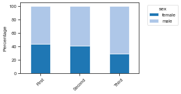

### 04 heatmap

``` python
from kplot.heatmap import get_similarity, plot_corr, plot_confusion_matrix
```

``` python
import seaborn as sns

# Set up the objects used by the examples below.
df = sns.load_dataset('titanic').dropna(subset=['age', 'fare', 'class', 'sex', 'survived']).reset_index(drop=True)
df2 = df[['age', 'fare', 'sibsp', 'parch']].head(8).copy()
df2.index = [f'row_{i}' for i in range(len(df2))]
print(df.shape)
print(df2.shape)
```

    (714, 15)
    (8, 4)

``` python
# Calculate both distance and similarity matrices for a dataframe.
get_similarity(df2)[0]
```

<div>
<style scoped>
    .dataframe tbody tr th:only-of-type {
        vertical-align: middle;
    }
&#10;    .dataframe tbody tr th {
        vertical-align: top;
    }
&#10;    .dataframe thead th {
        text-align: right;
    }
</style>

<table class="dataframe" data-quarto-postprocess="true" data-border="1">
<thead>
<tr style="text-align: right;">
<th data-quarto-table-cell-role="th"></th>
<th data-quarto-table-cell-role="th">row_0</th>
<th data-quarto-table-cell-role="th">row_1</th>
<th data-quarto-table-cell-role="th">row_2</th>
<th data-quarto-table-cell-role="th">row_3</th>
<th data-quarto-table-cell-role="th">row_4</th>
<th data-quarto-table-cell-role="th">row_5</th>
<th data-quarto-table-cell-role="th">row_6</th>
<th data-quarto-table-cell-role="th">row_7</th>
</tr>
</thead>
<tbody>
<tr>
<td data-quarto-table-cell-role="th">row_0</td>
<td>0.000000</td>
<td>66.001996</td>
<td>4.177993</td>
<td>47.657345</td>
<td>13.062925</td>
<td>54.911521</td>
<td>24.415786</td>
<td>6.714166</td>
</tr>
<tr>
<td data-quarto-table-cell-role="th">row_1</td>
<td>66.001996</td>
<td>0.000000</td>
<td>64.492435</td>
<td>18.429118</td>
<td>63.312323</td>
<td>25.182682</td>
<td>61.821302</td>
<td>61.188418</td>
</tr>
<tr>
<td data-quarto-table-cell-role="th">row_2</td>
<td>4.177993</td>
<td>64.492435</td>
<td>0.000000</td>
<td>46.073643</td>
<td>9.000868</td>
<td>52.100901</td>
<td>27.548548</td>
<td>3.910651</td>
</tr>
<tr>
<td data-quarto-table-cell-role="th">row_3</td>
<td>47.657345</td>
<td>18.429118</td>
<td>46.073643</td>
<td>0.000000</td>
<td>45.061097</td>
<td>19.066500</td>
<td>46.039121</td>
<td>42.780883</td>
</tr>
<tr>
<td data-quarto-table-cell-role="th">row_4</td>
<td>13.062925</td>
<td>63.312323</td>
<td>9.000868</td>
<td>45.061097</td>
<td>0.000000</td>
<td>47.754949</td>
<td>35.618122</td>
<td>8.803791</td>
</tr>
<tr>
<td data-quarto-table-cell-role="th">row_5</td>
<td>54.911521</td>
<td>25.182682</td>
<td>52.100901</td>
<td>19.066500</td>
<td>47.754949</td>
<td>0.000000</td>
<td>60.513388</td>
<td>48.906725</td>
</tr>
<tr>
<td data-quarto-table-cell-role="th">row_6</td>
<td>24.415786</td>
<td>61.821302</td>
<td>27.548548</td>
<td>46.039121</td>
<td>35.618122</td>
<td>60.513388</td>
<td>0.000000</td>
<td>27.089433</td>
</tr>
<tr>
<td data-quarto-table-cell-role="th">row_7</td>
<td>6.714166</td>
<td>61.188418</td>
<td>3.910651</td>
<td>42.780883</td>
<td>8.803791</td>
<td>48.906725</td>
<td>27.089433</td>
<td>0.000000</td>
</tr>
</tbody>
</table>

</div>

``` python
# Plot a square matrix with an optional triangular mask.
plot_corr(df[['age', 'fare', 'sibsp', 'parch']].corr(numeric_only=True))
```

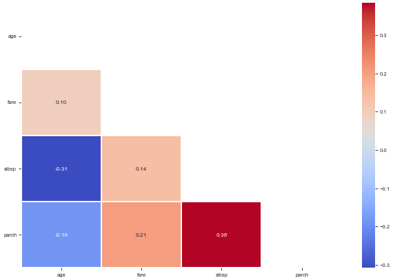

``` python
# Plot a confusion matrix from target and prediction arrays.
plot_confusion_matrix(df['survived'], df['adult_male'], class_names=['False', 'True'], normalize=True)
```

    Normalized confusion matrix

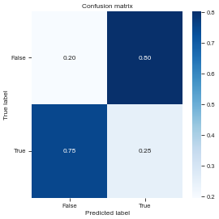

### 05 hierarchical

``` python
from kplot.hierarchical import get_1d_distance, get_1d_distance_parallel, get_Z, plot_dendrogram, get_hcluster
```

``` python
import pandas as pd,numpy as np,seaborn as sns
from scipy.spatial.distance import euclidean

# Set up the objects used by the examples below.
df0=sns.load_dataset("iris")
df = df0.drop(columns="species")

def my_distance(u, v):
    return np.sum(np.abs(u - v))

A = np.array([[0, 0], [1, 1], [2, 2]])

df0.head()
```

<div>
<style scoped>
    .dataframe tbody tr th:only-of-type {
        vertical-align: middle;
    }
&#10;    .dataframe tbody tr th {
        vertical-align: top;
    }
&#10;    .dataframe thead th {
        text-align: right;
    }
</style>

<table class="dataframe" data-quarto-postprocess="true" data-border="1">
<thead>
<tr style="text-align: right;">
<th data-quarto-table-cell-role="th"></th>
<th data-quarto-table-cell-role="th">sepal_length</th>
<th data-quarto-table-cell-role="th">sepal_width</th>
<th data-quarto-table-cell-role="th">petal_length</th>
<th data-quarto-table-cell-role="th">petal_width</th>
<th data-quarto-table-cell-role="th">species</th>
</tr>
</thead>
<tbody>
<tr>
<td data-quarto-table-cell-role="th">0</td>
<td>5.1</td>
<td>3.5</td>
<td>1.4</td>
<td>0.2</td>
<td>setosa</td>
</tr>
<tr>
<td data-quarto-table-cell-role="th">1</td>
<td>4.9</td>
<td>3.0</td>
<td>1.4</td>
<td>0.2</td>
<td>setosa</td>
</tr>
<tr>
<td data-quarto-table-cell-role="th">2</td>
<td>4.7</td>
<td>3.2</td>
<td>1.3</td>
<td>0.2</td>
<td>setosa</td>
</tr>
<tr>
<td data-quarto-table-cell-role="th">3</td>
<td>4.6</td>
<td>3.1</td>
<td>1.5</td>
<td>0.2</td>
<td>setosa</td>
</tr>
<tr>
<td data-quarto-table-cell-role="th">4</td>
<td>5.0</td>
<td>3.6</td>
<td>1.4</td>
<td>0.2</td>
<td>setosa</td>
</tr>
</tbody>
</table>

</div>

``` python
# Compute 1D distance (like pdist from scipy) but for df with column names
# return 1d distance
get_1d_distance(pd.DataFrame(A),func_flat=my_distance)
```

    100%|██████████| 3/3 [00:00<00:00, 3381.59it/s]

    array([2, 4, 2])

``` python
# Parallel compute 1D distance for each row in a dataframe given a distance function
# get_1d_distance_parallel(df, func_flat=my_distance)
```

``` python
# Get linkage matrix Z from pssms dataframe
Z = get_Z(df,func_flat=euclidean,parallel=False)
```

    100%|██████████| 150/150 [00:00<00:00, 532.10it/s]

``` python
# Run the example.
plot_dendrogram(Z,dense=10,labels=df.index,thr=0.5)
```

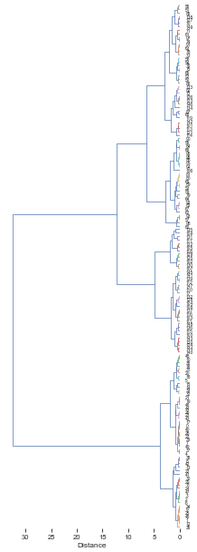

``` python
# Get flat cluster assignments from hierarchical clustering linkage matrix `Z`.
get_hcluster(df,labels=df0['species'].tolist(),thr=5,dense=10)
```

    0      1
    1      1
    2      1
    3      1
    4      1
          ..
    145    2
    146    4
    147    2
    148    2
    149    4
    Length: 150, dtype: int32

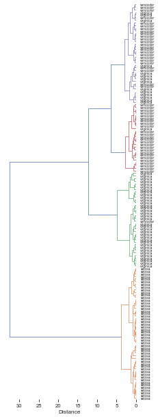

### 06 ranking

``` python
from kplot.ranking import plot_rank, get_AUCDF
```

``` python
import seaborn as sns

# Set up the objects used by the examples below.
df = sns.load_dataset('tips')
df.shape
```

    (244, 7)

``` python
# Plot a ranked scatter and annotate the highest and lowest entries.
sort_df=df.sort_values('total_bill').copy()
sort_df['id'] = sort_df.index.astype(str)
```

``` python
plot_rank(sort_df, x='id', y='total_bill', n_hi=10, n_lo=10)
```

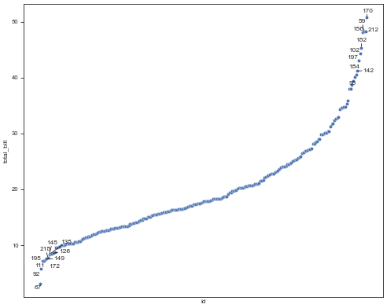

``` python
# Compute the normalized area under an empirical CDF over rank values.
get_AUCDF(df, 'total_bill', plot=True)
```

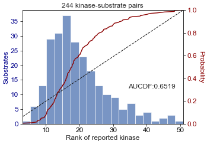

    0.6519265042202643
