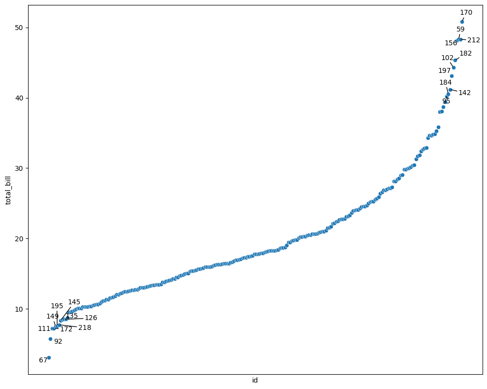
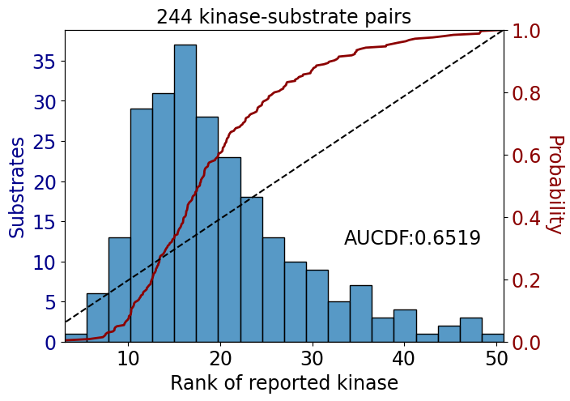

# ranking


<!-- WARNING: THIS FILE WAS AUTOGENERATED! DO NOT EDIT! -->

``` python
df = sns.load_dataset('tips')
df.shape
```

    (244, 7)

``` python
df.head()
```

<div>
<style scoped>
    .dataframe tbody tr th:only-of-type {
        vertical-align: middle;
    }
&#10;    .dataframe tbody tr th {
        vertical-align: top;
    }
&#10;    .dataframe thead th {
        text-align: right;
    }
</style>

<table class="dataframe" data-quarto-postprocess="true" data-border="1">
<thead>
<tr style="text-align: right;">
<th data-quarto-table-cell-role="th"></th>
<th data-quarto-table-cell-role="th">total_bill</th>
<th data-quarto-table-cell-role="th">tip</th>
<th data-quarto-table-cell-role="th">sex</th>
<th data-quarto-table-cell-role="th">smoker</th>
<th data-quarto-table-cell-role="th">day</th>
<th data-quarto-table-cell-role="th">time</th>
<th data-quarto-table-cell-role="th">size</th>
</tr>
</thead>
<tbody>
<tr>
<td data-quarto-table-cell-role="th">0</td>
<td>16.99</td>
<td>1.01</td>
<td>Female</td>
<td>No</td>
<td>Sun</td>
<td>Dinner</td>
<td>2</td>
</tr>
<tr>
<td data-quarto-table-cell-role="th">1</td>
<td>10.34</td>
<td>1.66</td>
<td>Male</td>
<td>No</td>
<td>Sun</td>
<td>Dinner</td>
<td>3</td>
</tr>
<tr>
<td data-quarto-table-cell-role="th">2</td>
<td>21.01</td>
<td>3.50</td>
<td>Male</td>
<td>No</td>
<td>Sun</td>
<td>Dinner</td>
<td>3</td>
</tr>
<tr>
<td data-quarto-table-cell-role="th">3</td>
<td>23.68</td>
<td>3.31</td>
<td>Male</td>
<td>No</td>
<td>Sun</td>
<td>Dinner</td>
<td>2</td>
</tr>
<tr>
<td data-quarto-table-cell-role="th">4</td>
<td>24.59</td>
<td>3.61</td>
<td>Female</td>
<td>No</td>
<td>Sun</td>
<td>Dinner</td>
<td>4</td>
</tr>
</tbody>
</table>

</div>

## Ranking Plots

------------------------------------------------------------------------

### plot_rank

``` python

def plot_rank(
    sorted_df:DataFrame, # dataframe already sorted by the ranking value
    x:str, # label column used for annotations
    y:str, # numeric ranking column
    n_hi:int | None=10, # number of items to annotate at the head
    n_lo:int | None=10, # number of items to annotate at the tail
    figsize:tuple=(10, 8), # figure size in inches
    data:NoneType=None, hue:NoneType=None, size:NoneType=None, style:NoneType=None, palette:NoneType=None,
    hue_order:NoneType=None, hue_norm:NoneType=None, sizes:NoneType=None, size_order:NoneType=None,
    size_norm:NoneType=None, markers:bool=True, style_order:NoneType=None, legend:str='auto', ax:NoneType=None
):

```

*Plot a ranked scatter and annotate the highest and lowest entries.*

``` python
sort_df=df.sort_values('total_bill').copy()
sort_df['id'] = sort_df.index.astype(str)
```

``` python
plot_rank(sort_df, x='id', y='total_bill', n_hi=10, n_lo=10)
```



## Rank Summary Metrics, AUCDF

We compute the area under the empirical cumulative distribution function
(CDF) as a function of kinase rank using the trapezoidal rule.  
Let $ r\_{(1)} \< r\_{(2)} \< \< r\_{(n)} $ be the sorted rank values
(e.g., 1, 2, …, *n*), and define the empirical CDF values as:

$$
F(r\_{(i)}) = \frac{i}{n}
$$

The normalized area under this CDF-vs-rank curve (AUCDF) is then
computed via the trapezoidal rule:

$$
\text{AUC}\_{\text{CDF}} =
\frac{1}{r\_{\max} - r\_{\min}} \sum\_{i=1}^{n-1}
\frac{F(r\_{(i)}) + F(r\_{(i+1)})}{2} \cdot (r\_{(i+1)} - r\_{(i)})
$$

where $ r\_{} = r\_{(1)} $, typically 1; $ r\_{} = r\_{(n)} $, typically
*n*.

This measures how quickly the cumulative mass increases across the
ranked kinases. If better kinases (lower rank) tend to appear earlier in
the CDF, the AUCDF will be higher.

------------------------------------------------------------------------

### get_AUCDF

``` python

def get_AUCDF(
    df:DataFrame, # dataframe containing the ranking column
    col:str, # numeric ranking column
    reverse:bool=False, # flip the empirical CDF direction
    plot:bool=True, # whether to draw the histogram and CDF panels
    xlabel:str='Rank of kinase', # x-axis label for the histogram
    ylabel:str='Substrates', # y-axis label for the histogram
)->float:

```

*Compute the normalized area under an empirical CDF over rank values.*

``` python
get_AUCDF(df, 'total_bill', plot=True)
```



    0.6519265042202643
