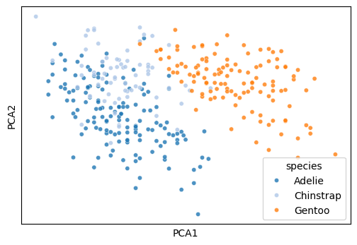
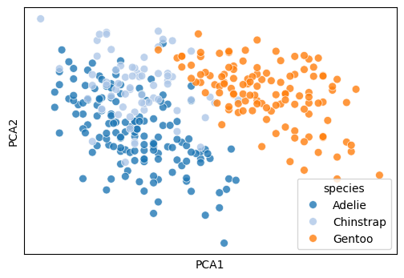
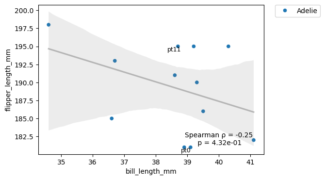

# scatter


<!-- WARNING: THIS FILE WAS AUTOGENERATED! DO NOT EDIT! -->

``` python
df = sns.load_dataset('penguins').dropna().reset_index(drop=True)
df2 = df[['bill_length_mm', 'bill_depth_mm', 'flipper_length_mm', 'body_mass_g']]
print(df.shape)
print(df2.shape)
```

    (333, 7)
    (333, 4)

``` python
df.head()
```

<div>
<style scoped>
    .dataframe tbody tr th:only-of-type {
        vertical-align: middle;
    }
&#10;    .dataframe tbody tr th {
        vertical-align: top;
    }
&#10;    .dataframe thead th {
        text-align: right;
    }
</style>

<table class="dataframe" data-quarto-postprocess="true" data-border="1">
<thead>
<tr style="text-align: right;">
<th data-quarto-table-cell-role="th"></th>
<th data-quarto-table-cell-role="th">species</th>
<th data-quarto-table-cell-role="th">island</th>
<th data-quarto-table-cell-role="th">bill_length_mm</th>
<th data-quarto-table-cell-role="th">bill_depth_mm</th>
<th data-quarto-table-cell-role="th">flipper_length_mm</th>
<th data-quarto-table-cell-role="th">body_mass_g</th>
<th data-quarto-table-cell-role="th">sex</th>
</tr>
</thead>
<tbody>
<tr>
<td data-quarto-table-cell-role="th">0</td>
<td>Adelie</td>
<td>Torgersen</td>
<td>39.1</td>
<td>18.7</td>
<td>181.0</td>
<td>3750.0</td>
<td>Male</td>
</tr>
<tr>
<td data-quarto-table-cell-role="th">1</td>
<td>Adelie</td>
<td>Torgersen</td>
<td>39.5</td>
<td>17.4</td>
<td>186.0</td>
<td>3800.0</td>
<td>Female</td>
</tr>
<tr>
<td data-quarto-table-cell-role="th">2</td>
<td>Adelie</td>
<td>Torgersen</td>
<td>40.3</td>
<td>18.0</td>
<td>195.0</td>
<td>3250.0</td>
<td>Female</td>
</tr>
<tr>
<td data-quarto-table-cell-role="th">3</td>
<td>Adelie</td>
<td>Torgersen</td>
<td>36.7</td>
<td>19.3</td>
<td>193.0</td>
<td>3450.0</td>
<td>Female</td>
</tr>
<tr>
<td data-quarto-table-cell-role="th">4</td>
<td>Adelie</td>
<td>Torgersen</td>
<td>39.3</td>
<td>20.6</td>
<td>190.0</td>
<td>3650.0</td>
<td>Male</td>
</tr>
</tbody>
</table>

</div>

## Dimensionality Reduction

------------------------------------------------------------------------

### reduce_feature

``` python

def reduce_feature(
    df:DataFrame, # numeric feature matrix
    method:str='pca', # one of pca, tsne, umap
    complexity:int=20, # perplexity for tsne or neighbors for umap
    n:int=2, # number of output dimensions
    load:str | pathlib.Path | None=None, # path to a previously fitted reducer
    save:str | pathlib.Path | None=None, # optional path for persisting the reducer
    seed:int=123, # random_state used by reducers that support it
    kwargs:VAR_KEYWORD
)->DataFrame: # forwarded reducer kwargs

```

*Reduce a feature matrix to a lower-dimensional embedding dataframe.*

``` python
reduce_feature(df2, method='pca', n=2)
```

<div>
<style scoped>
    .dataframe tbody tr th:only-of-type {
        vertical-align: middle;
    }
&#10;    .dataframe tbody tr th {
        vertical-align: top;
    }
&#10;    .dataframe thead th {
        text-align: right;
    }
</style>

<table class="dataframe" data-quarto-postprocess="true" data-border="1">
<thead>
<tr style="text-align: right;">
<th data-quarto-table-cell-role="th"></th>
<th data-quarto-table-cell-role="th">PCA1</th>
<th data-quarto-table-cell-role="th">PCA2</th>
</tr>
</thead>
<tbody>
<tr>
<td data-quarto-table-cell-role="th">0</td>
<td>-457.325073</td>
<td>-13.351587</td>
</tr>
<tr>
<td data-quarto-table-cell-role="th">1</td>
<td>-407.252205</td>
<td>-9.179113</td>
</tr>
<tr>
<td data-quarto-table-cell-role="th">2</td>
<td>-957.044676</td>
<td>8.160444</td>
</tr>
<tr>
<td data-quarto-table-cell-role="th">3</td>
<td>-757.115802</td>
<td>1.867653</td>
</tr>
<tr>
<td data-quarto-table-cell-role="th">4</td>
<td>-557.177302</td>
<td>-3.389158</td>
</tr>
<tr>
<td data-quarto-table-cell-role="th">...</td>
<td>...</td>
<td>...</td>
</tr>
<tr>
<td data-quarto-table-cell-role="th">328</td>
<td>718.068699</td>
<td>2.338199</td>
</tr>
<tr>
<td data-quarto-table-cell-role="th">329</td>
<td>643.090909</td>
<td>4.280699</td>
</tr>
<tr>
<td data-quarto-table-cell-role="th">330</td>
<td>1543.098355</td>
<td>-2.232010</td>
</tr>
<tr>
<td data-quarto-table-cell-role="th">331</td>
<td>992.994900</td>
<td>-4.605154</td>
</tr>
<tr>
<td data-quarto-table-cell-role="th">332</td>
<td>1193.002584</td>
<td>-5.417312</td>
</tr>
</tbody>
</table>

<p>333 rows × 2 columns</p>
</div>

## Scatter Plots

------------------------------------------------------------------------

### plot_2d

``` python

def plot_2d(
    embedding_df:DataFrame, # dataframe with at least two numeric columns
    hue:str | None=None, # column name used for color when present in embedding_df
    palette:str='tab20', # seaborn palette name
    legend:bool=False, # whether to draw a legend
    name_list:list[str] | None=None, # labels used to annotate points
    s:int=20, # marker size
    legend_title:str | None=None, # optional legend title override
    kwargs:VAR_KEYWORD
):

```

*Plot the first two columns of an embedding dataframe.*

``` python
df2 = reduce_feature(df[['bill_length_mm', 'bill_depth_mm', 'flipper_length_mm', 'body_mass_g']], method='pca', n=2)
df2['species'] = df['species'].values
plot_2d(df2, hue='species', legend=True)
```



------------------------------------------------------------------------

### plot_cluster

``` python

def plot_cluster(
    df:DataFrame, # numeric feature matrix, optionally including a hue column
    method:str='pca', # one of pca, tsne, umap
    hue:str | pandas.Series | list | None=None, # hue column name or per-row hue values
    complexity:int=30, # perplexity for tsne or neighbors for umap
    palette:str='tab20', # seaborn palette name
    legend:bool=False, # whether to draw a legend
    name_list:list[str] | None=None, # point annotations
    seed:int=123, # random seed passed to the reducer
    s:int=50, # marker size
    legend_title:str | None=None, # optional legend title override
    kwargs:VAR_KEYWORD
):

```

*Reduce features and immediately plot the first two embedding
dimensions.*

``` python
plot_cluster(df[['bill_length_mm', 'bill_depth_mm', 'flipper_length_mm', 'body_mass_g', 'species']], method='pca', hue='species', legend=True)
```



## Correlation Plot

------------------------------------------------------------------------

### plot_rel

``` python

def plot_rel(
    df:DataFrame, # dataframe that contains the x and y columns
    x:str, # x-axis column name
    y:str, # y-axis column name
    text_location:tuple=(0.8, 0.1), # annotation location in axes coordinates
    method:str | None='spearman', # one of spearman, pearson, or None
    index_list:list[str] | None=None, # row labels to annotate
    hue:str | None=None, # optional categorical hue column
    reg_line:bool=True, # whether to draw a regression line when hue is used
    data:NoneType=None, x_estimator:NoneType=None, x_bins:NoneType=None, x_ci:str='ci', scatter:bool=True,
    fit_reg:bool=True, ci:int=95, n_boot:int=1000, units:NoneType=None, seed:NoneType=None, order:int=1,
    logistic:bool=False, lowess:bool=False, robust:bool=False, logx:bool=False, x_partial:NoneType=None,
    y_partial:NoneType=None, truncate:bool=True, dropna:bool=True, x_jitter:NoneType=None, y_jitter:NoneType=None,
    label:NoneType=None, color:NoneType=None, marker:str='o', scatter_kws:NoneType=None, line_kws:NoneType=None,
    ax:NoneType=None
):

```

*Plot a pairwise relationship with an optional correlation annotation.*

``` python
df2 = df[['bill_length_mm', 'flipper_length_mm', 'species']].head(12).copy()
df2.index = [f'pt{i}' for i in range(len(df2))]
plot_rel(df2, x='bill_length_mm', y='flipper_length_mm', hue='species', index_list=['pt0', 'pt11'])
```


