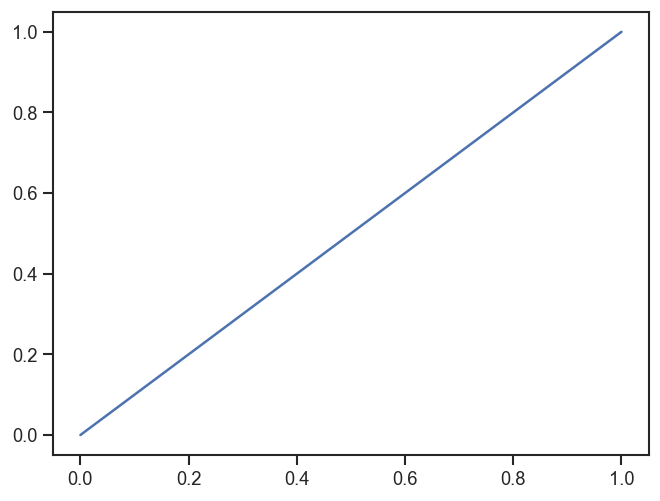
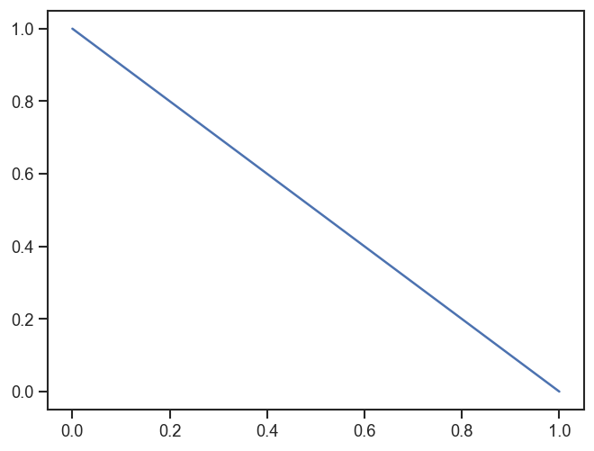
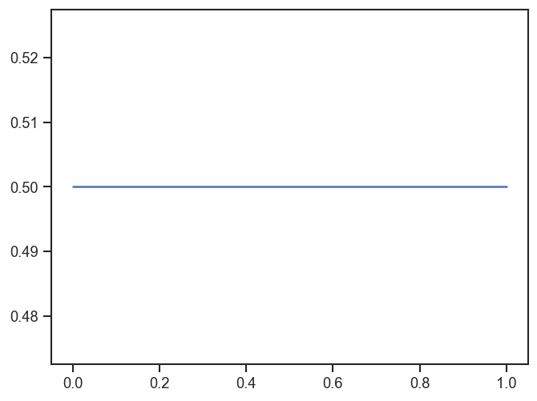
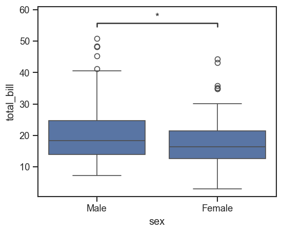

# utils


<!-- WARNING: THIS FILE WAS AUTOGENERATED! DO NOT EDIT! -->

``` python
df = sns.load_dataset('tips')
df.shape
```

    (244, 7)

``` python
df.head()
```

<div>
<style scoped>
    .dataframe tbody tr th:only-of-type {
        vertical-align: middle;
    }
&#10;    .dataframe tbody tr th {
        vertical-align: top;
    }
&#10;    .dataframe thead th {
        text-align: right;
    }
</style>

<table class="dataframe" data-quarto-postprocess="true" data-border="1">
<thead>
<tr style="text-align: right;">
<th data-quarto-table-cell-role="th"></th>
<th data-quarto-table-cell-role="th">total_bill</th>
<th data-quarto-table-cell-role="th">tip</th>
<th data-quarto-table-cell-role="th">sex</th>
<th data-quarto-table-cell-role="th">smoker</th>
<th data-quarto-table-cell-role="th">day</th>
<th data-quarto-table-cell-role="th">time</th>
<th data-quarto-table-cell-role="th">size</th>
</tr>
</thead>
<tbody>
<tr>
<td data-quarto-table-cell-role="th">0</td>
<td>16.99</td>
<td>1.01</td>
<td>Female</td>
<td>No</td>
<td>Sun</td>
<td>Dinner</td>
<td>2</td>
</tr>
<tr>
<td data-quarto-table-cell-role="th">1</td>
<td>10.34</td>
<td>1.66</td>
<td>Male</td>
<td>No</td>
<td>Sun</td>
<td>Dinner</td>
<td>3</td>
</tr>
<tr>
<td data-quarto-table-cell-role="th">2</td>
<td>21.01</td>
<td>3.50</td>
<td>Male</td>
<td>No</td>
<td>Sun</td>
<td>Dinner</td>
<td>3</td>
</tr>
<tr>
<td data-quarto-table-cell-role="th">3</td>
<td>23.68</td>
<td>3.31</td>
<td>Male</td>
<td>No</td>
<td>Sun</td>
<td>Dinner</td>
<td>2</td>
</tr>
<tr>
<td data-quarto-table-cell-role="th">4</td>
<td>24.59</td>
<td>3.61</td>
<td>Female</td>
<td>No</td>
<td>Sun</td>
<td>Dinner</td>
<td>4</td>
</tr>
</tbody>
</table>

</div>

## Setup Helpers

------------------------------------------------------------------------

### set_sns

``` python

def set_sns(
    dpi:int=300
)->None:

```

*Set seaborn defaults for notebook display and saved figures.*

``` python
set_sns(dpi=50)
```

------------------------------------------------------------------------

### save_svg

``` python

def save_svg(
    path:str | pathlib.Path
)->None:

```

*Save the current matplotlib figure as SVG with editable text.*

``` python
plt.figure()
plt.plot([0, 1], [0, 1])
# save_svg(Path('nbs') / '_tmp_utils.svg')
```



------------------------------------------------------------------------

### save_pdf

``` python

def save_pdf(
    path:str | pathlib.Path
)->None:

```

*Save the current matplotlib figure as PDF with TrueType fonts.*

``` python
plt.figure()
plt.plot([0, 1], [1, 0])
# save_pdf(Path('nbs') / '_tmp_utils.pdf')
```



------------------------------------------------------------------------

### save_show

``` python

def save_show(
    path:str | pathlib.Path | None=None, # output path when saving instead of showing
    show_only:bool=False, # force plt.show even when no path is provided
)->None:

```

*Show the current figure or save it, then close open figures.*

``` python
plt.figure()
plt.plot([0, 1], [0.5, 0.5])
# save_show(path=Path('nbs') / '_tmp_utils_show.png')
```



## Palette Helpers

------------------------------------------------------------------------

### get_color_dict

``` python

def get_color_dict(
    categories:list, # labels that need colors
    palette:str='tab20', # seaborn palette name
)->dict:

```

*Assign colors to labels while tolerating duplicate category names.*

``` python
get_color_dict(['A', 'B', 'C'], palette='Set2')
```

    {'A': (0.4, 0.7607843137254902, 0.6470588235294118),
     'B': (0.9882352941176471, 0.5529411764705883, 0.3843137254901961),
     'C': (0.5529411764705883, 0.6274509803921569, 0.796078431372549)}

------------------------------------------------------------------------

### get_plt_color

``` python

def get_plt_color(
    palette:dict | list | str, # dict lookup, explicit list, or palette name
    columns:list, # plotted column names in output order
)->list:

```

*Return colors in plotting order for a dict, list, or named palette.*

``` python
get_plt_color('Set2', ['a', 'b'])
```

<svg  width="110" height="55"><rect x="0" y="0" width="55" height="55" style="fill:#66c2a5;stroke-width:2;stroke:rgb(255,255,255)"/><rect x="55" y="0" width="55" height="55" style="fill:#fc8d62;stroke-width:2;stroke:rgb(255,255,255)"/></svg>

------------------------------------------------------------------------

### get_hue_big

``` python

def get_hue_big(
    df:DataFrame, # source dataframe
    hue_col:str, # categorical column used for hue
    cnt_thr:int=10, # minimum count retained in the filtered hue series
)->Series:

```

*Filter a hue column down to categories that meet a count threshold.*

``` python
# get_hue_big(df, 'day', cnt_thr=40).tolist()
```

## Statistical Annotations

------------------------------------------------------------------------

### add_stats

``` python

def add_stats(
    ax, df, value, group, test:str='t-test_ind', loc:str='inside', text_format:str='star', min_n:int=3,
    kwargs:VAR_KEYWORD
):

```

*If `value` is str:* compare between groups (x=group, y=value) If
`value` is list/tuple: compare among values within each group (x=group,
hue=‘variable’)

``` python
fig, ax = plt.subplots(figsize=(5, 4))
sns.boxplot(data=df, x='sex', y='total_bill', ax=ax)
add_stats(ax, df, value='total_bill', group='sex')
```


